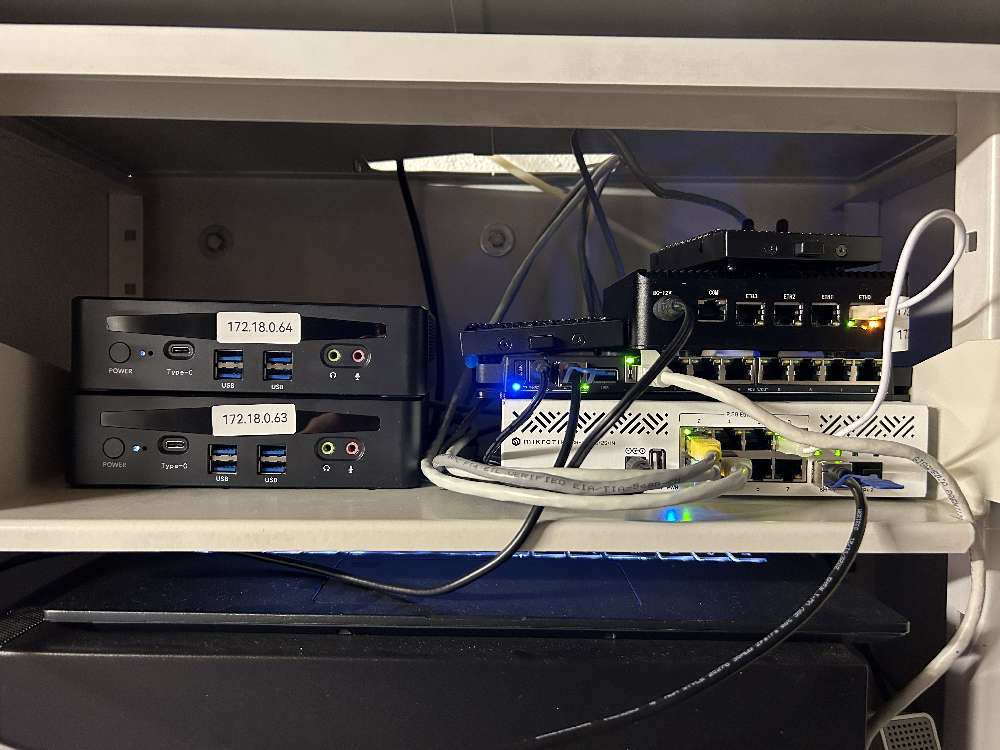
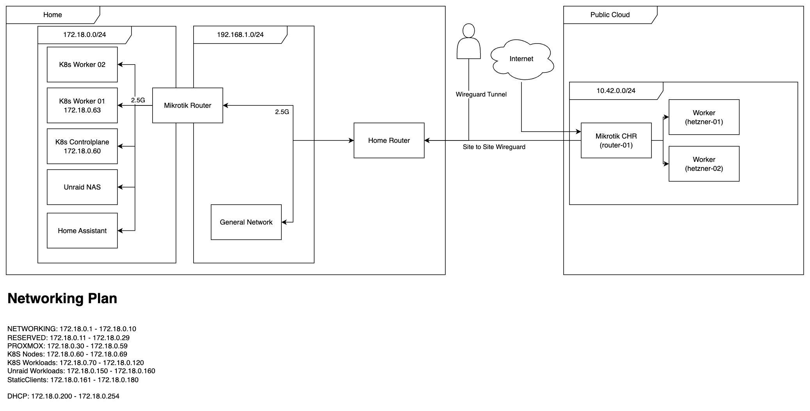

+++
title = "Building a homelab"
date = 2023-10-28T19:44:15+02:00
draft = false
toc = true
tocBorder = true
author= "Loris Polenz"
+++
*No GenAI was used for this article*

This blog post should give an overview of a few projects and ideas that I worked on centered around my homelab. There are many more things that I have worked on; they might also have an article in this blog. If there are any questions or inputs, feel free to reach out to [contact@lorispolenz.com](mailto:contact@lorispolenz.com)

# Why?
There is no *reasonable* justification for the financial and time investment into a homelab of this extent. However, I need a place where I can store my data and run my workloads that is not just someone else's computer, aka. the cloud. Having control over software, networking, and hardware is not just practical - it's also fun*. I must note that the current setup has evolved over a few years with the tendency to get bigger and more overkill for every purchase. 

\* When everything works as expected

## Why k8s
Obviously I like the idea of containers, and I also like to orchestrate them. There are for sure tools that are less complex than k8s and would work for me as well. I would have never touched K8s if I were not already using it in a professional setting and also working on a K8s certification with the need to test around a bit - at the end I am still running a homelab for testing and learning. 
This was the reason for the first cluster being a mini PC (worker) and an old notebook as a worker/control plane node. 

For the next generation of the K8s platform in my basement, some requirements were added—as K8s was not just for testing anymore, I had some productive workloads running on it.

## Why Talos Linux?
One day in January 2024, I was notified by my monitoring that one of my most important services was not running anymore. Not thinking much of it, I kept working at my day job to address the issue later once I'm at home. At said home, it turned out that the issue was not as minor as I initially thought. At the time I ran Ubuntu Server, where I installed the kubelet using kubeadm - what I did not know was that I needed to rotate the certificates in the cluster. The result was a K8s cluster in an unhealthy state, and my services were not running anymore. After some troubleshooting, the cluster was back up, and I could go to bed. 

As the old cluster was somewhat of a mess, I decided to start fresh and build a new cluster - this time with a dedicated control plane and two worker nodes. I chose Talos Linux for the following reasons:

### More Kubernetes, less OS
With the new cluster, I wanted to make sure to find a solution that I could keep running far in the future without major disruptions to my services. Talos enabled me to offload some things - like managing certificates - to the Talos OS. I also can think less about the security aspect of running an operating system and a K8s stack on top and just focus on the K8s part. 

### Operating System as Code
The declarative way of defining the Talos cluster was a happy addition, as all the services on the cluster will be deployed as code as well using Argo CD. This way, adding a new node or making a change to all the worker nodes is as simple as adding a line to a YAML and rolling it out to the workers. 

### Experience
I already set up a cluster using k3s and kubeadm, so Talos seemed like a good idea to try out next.  

## Why Mirktotik
When thinking about networking, the trend was clear: everyone uses Ubiquiti gear for its simple management and good prices. I would have gone the same route if there was no weird UniFi account requirement to use your gear as intended. I started tinkering around with Mikrotik Cloud Hosted Router (CHR) in the Hetzner Cloud and liked the idea of their products. Buy hardware, get an OS without any online accounts, and be happy - or as in the case with CHR, get a perpetual license and be happy. Mikrotik Router OS has a very steep learning curve, especially because I still do not have much knowledge in the sense of networking. 

# Requirements
The new setup had some requirements that needed to be fulfilled to enable adequate future-proofing of the setup. 

## Network Segregation
Before, all the devices for the whole household shared a 192.168.1.1/24 subnet. This was not good enough, as this would have compromised the security of the non-homelab devices if there were any breaches in the homelab. Thus the possibility of multiple subnets was required. 

## WireGuard Support
The router needs to be able to act as a WireGuard server and client for remote access and some "hybrid cloud" capabilities. This way some systems could also be routed to other VPN services, such as Mullvad, if required. 

## 2.5G Networking
As the existing hardware was already 2.5 Gbit networking capable, I have decided to make this a standard as well for the node-to-node communication. 

## VM Support
As some services cannot be containerized with full feature richness, such as Home Assistant, there needs to be a possibility to run virtual machines - this will be a small amount of deployments.

## Power & Space Constraints
The hardware needs to fit into a certain space, and the power usage should not be too high, so old server hardware would not be viable in both of these areas. In case of a power outage, essential services should keep running; thus, a UPS is required as well.

## Dedicated Storage
There needs to be at least one system built for mass storage of data where performance is not the most critical element. 

## Fast & Replicated Storage in Kubernetes
Services such as Elasticsearch handle data replication themselves, but they need fast storage for optimal performance. Thus, a drive needs to be available for local path storage. Another drive with storage for replicated storage needs to be available and set up as well—in case the service does not handle replication natively. 

## Selective Internet Ingress
In general, no client or service should be exposed directly to the internet. However, some services should be reachable from the internet to build public services based on on-prem data. 

## Optional: GPU Compute 
For some inference workloads, it would be useful to have a GPU available to run some everyday inference use cases; because of pricing and power usage, this is an optional requirement.

# Hardware
Based on the requirements and the already available hardware, the following setup was chosen:

## Networking
Router: `Mikrotik 5009UPr+S+IN` (1 10 Gbit SFP+, 1 2.5 Gbit, 8 Gbit with PoE)
Switch: `Mikrotik CRS310-8G+2S+IN` (2 10 Gbit SFP+, 8 2.5 Gbit)

The switch is via a 10 Gbit SFP+ DAC connected to the Mikrotik router. The MikroTik router has a 2.5 Gbit uplink to the home router. 

## Kubernetes
The control plane is a fanless N100-powered device with 4 2.5 Gbit Ethernet Ports - this device might be replaced in the future. The workers are AliExpress mini PCs with an Intel i5 1340p with 64 / 96 GB memory, a 1 TB M.2 SSD, and a 2 TB SATA SSD. These mini PCs each have two 2.5 Gbit Ethernet ports. 

Also visible is the old notebook running a single-node cluster that will be removed once the migration to the new solution is completed. 

## Storage
The box the notebook rests upon is an N100-powered NAS with 4 2.5 Gbit Ethernet ports and a RAID 1 configured 8 TB of usable storage space based on hard disks. 

## Power
The whole infrastructure, including the home router, is connected to a 1320W Powerwalker UPS to keep the systems running even when power is out.

# Network Architecture
Based on the requirements, the following network was designed and is also implemented in this way as described in the following drawing. For now, no VLANs or more than one subnet are defined, but this is planned for the future to also gain more knowledge in this domain. 

Kubernetes services can get their own IP addresses in the 172.18.0.0/24 subnet using MetallLB. This is relevant for services not behind a reverse proxy. 

Note: Both WireGuard instances connect directly to the MikroTik router using port forwarding. On Hetzner, the CHR instance is the only one with a public IPv4 address and a pretty strict firewall. Currently only connections from my home IP address and from Cloudflare are allowed. This way the attack surface can be reduced as well. 

# Infrastructure Services
Infrastructure services do not provide a direct value but are required to keep the system running and enable the actual services. 

## ArgoCD
Using ArgoCD, the whole cluster is managed using Infrastructure as Code - this way the cluster is clean and can be more easily recovered in case something happens. The IaC repo does not contain any secrets; however, I do not want it to be public for now, as it still contains valuable information in case of an attack. If you want to see the repo, feel free to reach out to [contact@lorispolenz.com](mailto:contact@lorispolenz.com)

## Argo Workflows
Argo Workflows is a workflow engine for Kubernetes. It enables multistage workflows executed based on a schedule or other triggers, such as new resources being added to the cluster. With Argo Workflows, custom images can be run as part of the automation, enabling custom software to be easily run. 

## Openebs
OpenEBS is the storage solution chosen for this setup. Using OpenEBS, both the M.2 NVMe drives and the SATA SSDs are allocated. The host path is available as one storage class for higher performance, but no replication - this data is on the NVMe SSD. There are two storage classes, one with a single replica and one with two replicas, both using the SATA SSDs. 

## Traefik
Traefik acts as a reverse proxy for all HTTP traffic - it also handles certificate generation using ACME to Let's Encrypt using DNS verification.

## Minio
Currently there are two MinIO instances, one on Kubernetes and one on the Unraid NAS system. The latter of which is used for long-term storage of data on hard disks or data where speed is not essential in the first place. The MinIO instance in Kubernetes has one replica per worker node with local storage to enable some replication and also improve speed - especially in cases where the data needs to be quickly available. 

## Elastic Operator (ECK Operator)
The Elastic Operator enables me to deploy Elastic components in my environment without having to manage large YAML files. 

## External Secrets
The external secrets operator is used to fetch secrets from an external secret manager into my Kubernetes environment. This step is crucial, as no secrets should be in any IaC configs, but I want to have them managed in an IaC way. 

## Kafka
Using Strimzi, I have set up a Kafka instance that I use as a central data platform for the whole cluster. The final idea is to have all data that is being sourced from somewhere sent to Kafka and consumed at another place. This way the same data can be used multiple times. 
In Logstash, a Kafka pattern is subscribed, and whenever a new topic fitting that pattern is getting new data, Logstash automatically indexes this data to elasticsearch - this way data can be indexed without a hassle. A nice benefit is this data can then be used by other services or processors as well. This way I could have an index with raw data and one that was processed in an Apache Spark pipeline. 

## Kubevirt
One of the requirements was to be able to run virtual machines on the new infrastructure. I basically had two ways on how to tackle this issue. Set up Proxmox on bare metal, run VMs and Kubernetes as a VM in Proxmox, or go the other direction and run Kubernetes bare metal and run VMs in Kubernetes. 

As most of my workloads are containerized, I chose the bare-metal Kubernetes route and chose Kubevirt to virtualize the few VMs that I need to keep running.

# Services
The main reason for this whole project is the services that are being hosted on said infrastructure. The hosted services all try to solve a specific issue or have a purpose for why they are important to me. 

## Elastic Stack
In general, data should be stored either on MinIO S3 or in Elasticsearch. Elastic provides me with the required query features, can act as a vector database, and the additional parts of the ELK Stack help with log and event management, such as Logstash. The decision in favor of the Elastic Stack was mainly because I work with Elastic daily and know it very well. 

## Twitch2Kafka
The Twitch2Kafka service is basically what it says in the name. A Python script subscribes to IRC feeds for certain streamers and is sending the messages to Kafka that are in turn indexed to Elasticsearch. Currently this data is not used for any specific purpose; however, in the future I want to do some NLP on this data. Sometimes it is also useful to see a message history if people write something in the chat and you want to get their virtual street credibility.

## Gplug
The [gplug](https://gplug.ch/produkte/gplugk/) is a device that can be put into a power meter and regularly sends the current power usage to an MQTT broker. This MQTT broker is then bridged to Kafka using Filebeat, which offers both an MQTT input and Kafka output. This way the Gplug data can be directly indexed to Elasticsearch. 

## Jellyfin
Some of the lectures for my studies are being recorded but are only provided as an MP4 file. This would be enough if we did not need basic things like progress tracking. For this, I have set up a Jellyfin instance with a file browser sidecar to upload the actual recordings to Jellyfin. 

In the future this Jellyfin instance might also be used for some video streaming of the other kind; however, for this I need to figure out how to handle storage for said video streaming, as the video files can get pretty large and not fit in the Kubernetes nodes anymore. 

## Home Assistant
Even though Home Assistant provides a Docker image for their service, there are some features that only work with Home Assistant OS. That's why I decided to run Home Assistant in a KubeVirt VM on Kubernetes. Because I use MetallLB, this VM can get a dedicated IP address and can be used as a regular VM.

## Goodnotes2Git
[Goodnotes2Git](https://github.com/LorisPolenz/goodnotes2git) is another service that basically explains itself with the name. For my studies, I need to be able to take notes by hand but also want to reference these notes in Obsidian for knowledge management and post-processing of lecture notes. 
GoodNotes provides an auto-backup feature to OneDrive - in my case, I use OneDrive for business with my own M365 Organisation - but I think it would work with regular OneDrive as well. 
The Goodnotes2Git script is deployed via Argo Workflows and runs every 5 minutes to check if there are any changes to the backup folder, and if so, takes the PDF and pushes it to Git. 

This service needs improvements in two ways. Currently the whole directory tree is checked every 5 minutes. I would see some trigger when a new file is added or one is updated. Also, Git is not designed to store PDFs; that's why LFS support will be added in the future. 

## Gym Tracker
I regularly go to the gym, and because I like data and, even better, act on said data, I fetch the current visitors in every gym I have access to and index this data to Elasticsearch. Based on this, I created a dashboard that I can use to decide which gym I want to head to based on the current visitors and maybe even the projected visitors if I feel very fancy and build in some prediction algorithm. 

## Media Downloader
I often face the issue that I see a funny or interesting post on social Media - or one with the potential to be deleted either by the user or platform. In all of these cases I want to have a local copy of these videos or pictures (no text is saved as of now). The Media Downloader combines a REST service that handles the download using GalleryDL and then uploads the data to an S3 bucket. Each user has a dedicated directory per platform. This enables me to search by user and time in the future. 
The URLs to the posts can be added via a simple web UI or a Telegram bot. 
In the future I might add some fancy processing to these videos to extract a transcript and an image description and then index these descriptions to Elasticsearch and build a RAG app from it. 

## GTFS Services
For this service some context is required, as this is the whole reason why this infrastructure was built in the first place. This chapter might deserve a dedicated blog entry in the future.

I often take a train that is scheduled to arrive at XX:25 every hour - my connection leaves at XX:27. This leaves me two minutes to switch somewhere between 5 to  10 platforms, which would be no issue **IF** the train has less than a 60s delay and I am already in the front. Now, I am usually on the back of the train as it's less packed. This means that I need to know about 10 minutes before arrival if my train is expected to be delayed by more than 60 seconds. 
The core issue here is SBB only shows delays > 3 minutes, as a train is only officially delayed if it is more than 3 minutes late. 

Thanks to open data, there is a GTFS-Realtime feed where you can query all the train delays all over Switzerland a maximum of twice every minute. I might only need the data for a specific train, but the [Bahn Mining Talk from David Kriesel](https://www.youtube.com/watch?v=0rb9CfOvojk) has inspired me to save all the data in case I ever need it. 

The following services support one part of this idea.

### GTFS-RT Fetcher
The [GTFS-Fetcher](https://github.com/LorisPolenz/fetch_gtfsrt_go) has seen many iterations and is responsible for fetching the current feed and storing it in S3 for further processing. This used to be a Python script that fetched the delays in JSON, compressed it, and stored it on S3. The main issue was that the JSON data was not standardized (which I had to learn the hard way), and the JSON format takes up more space compared to the recommended protobuf format. The new version written in Go fetches the protobuf and stores it compressed on S3 as well. 
The new solution should also speed up the processing in the future, as the uncompressed pb files are much smaller than the JSON files. 

### GTFS-FP Fetcher
[Fetch GTFS-FP](https://github.com/LorisPolenz/fetch_gtfs-fp)
The GTFS Realtime data needs to be correlated to a schedule. This schedule is published every few days and is used to give context to the real-time feed. This includes upcoming trips, new or changed train stations, and much more. This service is responsible for downloading this information and indexing some of it to Elasticsearch. Elastic will be the single source of truth for stops, trips, etc. 
There is a legacy instance that just wrote the GTFS timetable to S3 for further processing - this feature will be adopted by this service as well.

### GTFS-RT Aggregation / Enrichment (legacy)
[Legagy Aggregation](https://github.com/LorisPolenz/aggregate_gtfs)
For the JSON-based files, there is a Python processor that is part of the old workflow that would process the incoming JSON feed and enrich it with human-readable attributes such as stop names and then write the aggregated delays to a parquet file. This Parquet file could then be used for some further queries or even visualizations on a webpage. As the JSON format is not standardized, it changed and broke this part of the pipeline. This is being rewritten as of writing this. 

### GTFS-RT Enrichment 
There have been a few approaches on how to handle this; however, I am still in the process of figuring out a solution. It is noteworthy that the processor needs to process somewhere around 200k events every time a new export is created. To enrich this data quickly and enable quick queries is a challenge. Already following a few approaches on how I try to tackle this:
[Kafka Enricher](https://github.com/LorisPolenz/gtfsrt-kafka-enricher) subscribes to a Kafka topic, reads the topic, and publishes the processed records to another Kafka topic that then sends the events to Elasticsearch for indexing. 
[Enrich GTFS](https://github.com/LorisPolenz/enrich_gtfs) copies the functionality of the legacy enrichment just written in Go, based on a proto file and some planned enhancement in terms of output format, as a parquet file is not needed anymore when the data is available in Elasticsearch. 

### GTFS Aggregation UI
The [GTFS Aggregation UI](https://github.com/LorisPolenz/gtfs_aggregation_ui) was created to make the Parquet file created in previous stages available via a web UI with a small REST API in the background. This service might be adapted in the future and migrated to a new domain.  
